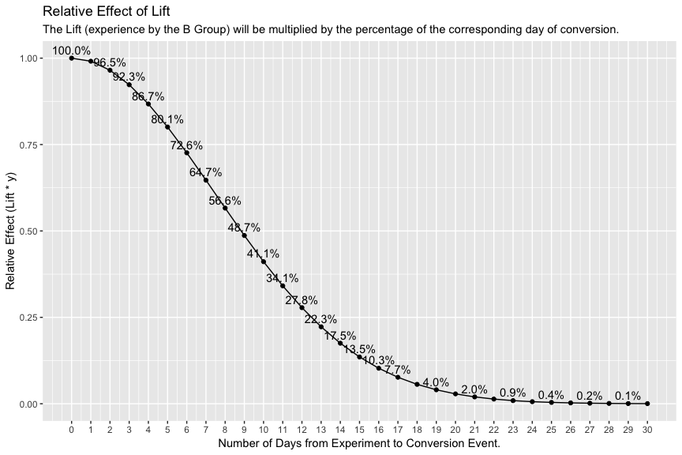
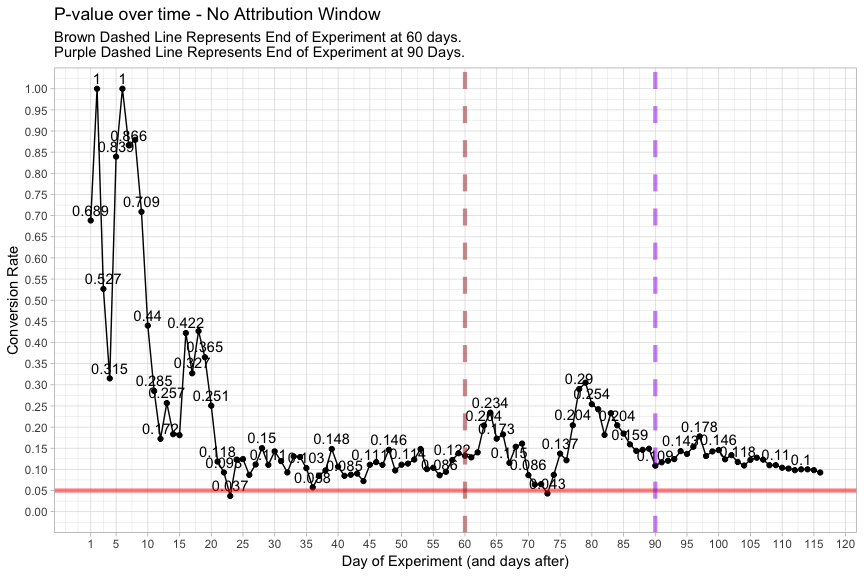
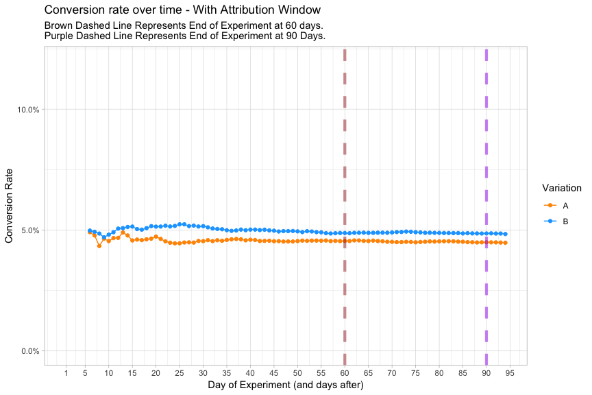
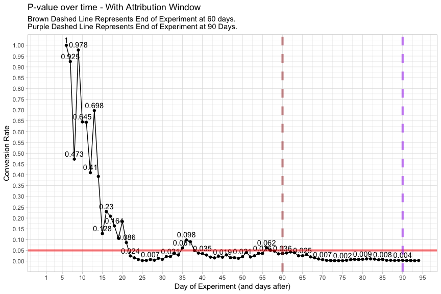

A/B Tests, Diminishing Lift, & Attribution Windows
==================================================

A few definitions:

-   `control`: refers to either the `A` group, or the thing you show to
    the `A` group
-   `variant`: refers to either the `B` group, or the thing you show to
    the `B` group
-   `variation`: refers to either the `A` (`control`) group or `B`
    (`variant`).
-   `lift`: the percent increase in the conversion rate (or the
    probability a random person will convert) from the `A` group to the
    `B` based on the thing you are testing in the `B` group (i.e. the
    `variant`)
-   `immediate lift`: the lift experienced among a subpopulation of
    people who convert in a relatively short amount of time, relative
    from when the variant is shown.
-   `diminishing lift`: the potential phenomenon where, the longer it
    takes people to convert relative from when the variant was seen, the
    less lift the group will experience from the variant.
-   `attribution window` the maximum number of days you allow
    conversions to be attributed to the corresponding variation based on
    when the person entered the experiment. So, person `x` enters the
    experiment on day `y`. With a `7-day` attribution window, we would
    only count `x`'s conversion if the conversion event took place
    within `7` days after `y`. This would be the same for both
    variations.

There are two questions when running A/B tests that don't seem to be discussed much.
------------------------------------------------------------------------------------

Let's say you're running an A/B test and the variant is outperforming
the control. My assumption is that, despite the overall outperformance
(i.e. the "lift") of the variant, the lift is highest in the first
moments that it is seen by each person, and then decreases over time,
such that the longer it takes the person to convert, the less impact
that the variant has (relative to the control) on their conversion
decision. In other words, the variant has provided an **immediate lift**
but the lift diminishes over time, such that the people in the `A` and
`B` groups who are converting sometime in the future (say, at the
extreme, a year after they saw the `control` and `variation`,
respectively) are converting at virtually the same conversion rates.(++)
We can probably make similar statements for (perhaps) days, (mostly
likely) weeks, and (certainly) months after the variation is seen.

If true, obviously the rate (or distribution of) of diminishing lift and
the time-period it takes for the lift to completely diminish depends on
the product/experiment/target-market/etc..

The concern is that, if a sub-population in our experiment (belonging to
both the control group and the variant group) are converting at the same
rates, **despite the immediate lift the variant has**, then when we
evaluate the results of the A/B test, those conversions are diluting, or
masking, the immediate lift that the variant gives, and we might
conclude that the variant has little or no effect. So, a contrived
example would be: for a given experiment, the variant has a 7%
statistically significant *immediate lift* (i.e. for the people who
convert within, say, 2 days, the variant out-performs the control by a
relative 7% increase in the conversion rate) but when looking at the
entire population (let's say they have all been given a month to
convert, and we analyze the results a month after the experiment ends),
the lift is only 3% and not statistically significant. Is this type of
contrived example realistic under some reasonable assumptions?+++

So, the first question is: **How does the diminishing lift of the
variant, over time, affect the outcome of the experiment?**

In the contrived example above, I implied that there was a 7% lift
detected if we used an attribution window of 2 days but only a 3% lift
detected if we used a 30-day attribution window. So, in the former case
we only counted conversions that happened within 2 days from the time a
given person saw the experiment to when they converted. In the latter
case, we counted conversions that happened within 30 days (from when the
experiment was seen to the conversion date). The other assumption
implied above was that this decrease was from the fact that, when
grouping people by the amount of days it takes them to convert, the
conversion rates of both groups start to converge as the lift from the
variant diminishes. And the more conversions that we count that have
diminished lift, the more diluted the results became.++++

But, the typical process for A/B testing doesn't seem to consider/use an
attribution windows at all: You run a test for, say, 30 days (depending
on your sample size calculation). The people who enter the experiment on
the first day it started get 30 days to convert (i.e. their conversion
event is counted at any point during the experiment). The people who
enter into the experiment on the last day get &lt;= 1 day to convert.
Perhaps some teams give an extra, say, 7 days for conversion (so people
who see the experiment on the first day, get 37 days to convert, people
who see it on the last day get 7 days.).

This introduces the next question: **What effect does an attribution
window have on the results of an experiment?**

We'll answer that question by making some reasonable assumptions about
the distributions of how long it takes people to convert and the
diminishing lift over time. It will be a contrived example, but the
purpose is **not** to show that the concerns from above and results from
below will show up in *every* A/B test, it is only to show what is
*possible* under *reasonable* assumptions.

------------------------------------------------------------------------

++*Perhaps this means that A/B testing is inherently targeting people
who either A) more susceptible to psychological manipulation (e.g. mind
hacks, high pressure sales tactics, buying things based on whether it's
sunny or dark outside, etc.) and/or B) wanting to make an immediately
decision and/or C) impulsive buyers, and/or etc.. But, that's a
direction I don't want to go right now. Of course, there caveat to this
is that there are experiments you run where, for example, you've
completely redesigned your product and the new experience does have a
long-lasting impact on the customers' decision. In those cases, the lift
is high enough that any concerns we deal with here are probably going to
disappear from the large lift. I assume that's not the case for most A/B
tests.*

+++*It’s worth noting that, for this example, the overall lift of the
variant on the entire population is, indeed, only 3%. My point is not
that `3%` is inaccurate, but that it includes people that, for an
abundance of possible reasons, aren’t as influenced by the variant
compared with others. So, are you trying to detect a 3% change to the
entire population, or a 7% change of the population that is inherently
more affected by A/B tests?*

++++*An issue rated to note(+++) is the sample size (and, therefore,
duration) of the experiment required to detect the lift, if it exists.
There are two relevant trade-offs. One trade-off is that using a smaller
attribution window leads to lower conversion rates (i.e. you are only
counting a subset of conversions). All other things considered, a lower
conversion rate requires a larger sample size. So, detecting a 5% change
with a baseline conversion rate of 20% takes longer to test than with a
baseline conversion rate of 30%. On the other hand, if you capture
enough signal in the immediate lift (again, if it exists) and reduce a
lot of the noise from the diminishing lift, a smaller attribution window
will increase the lift found. So for example, the sample size required
to detect a 3% change (from the control to the variant) is a lot larger
than the sample size required to detect a 7% change. Therefore, in order
to use attribution windows, the assumption is that these tradeoffs have
to either balance out, or at least don’t affect the feasibility of
running the A/B test.*

------------------------------------------------------------------------

Simulate A/B Groups
-------------------

Let's simulate a 60-day experiment where ~`1,333` people enter the
experiment daily, giving a total of about `80,000` trials during the
60-day experiment.

Then we'll randomly assign people into group `A` or group `B`, based on
a random number generator, which will be about `40,000` per randomized
variation.

Simulate Conversion Rates
-------------------------

### Simulate No Change

Now, we'll give everyone a baseline conversion rate of `10.0%`.

Specifically, we'll assign each person a conversion rate (i.e.
probability), then take a random sample from the binomial distribution
using their assigned probability to determine if that person converted.

Let's simulate the conversion decision for each person and see the
overall conversion rates for each variation.

We can see that the conversion rate for each group is roughly the same.
Using the Chi-Square test for proportions, we get a p-value of
`0.4750029`, so there is no statistical difference between the two
conversion rates.

So far, we've simulated an experiment in which there was **no** change
in the `A` group vs the `B` group. It was an experiment that is
equivalent to an `A`/`A` test.

### Simulate `7.00%` Increase in Group B

Now, let's simulate everyone in the `B` group having a `7.00%` increase
from the treatment effects of the new variant we are testing out. So
`B`'s conversion rate is now `10.7%` (i.e. `10.0%` + (`10.0%` \*
`7.00%`))

With the new conversion rate (and due to random variation i.e. random
sampling from binomial distribution), `B`'s conversion rate of `10.8%`
is a `7.36%` increase over the **true** baseline conversion rate of
`10.0%`, and a `5.15%` increase over `A`'s conversion rate of `10.2%`.

The P-value is now `0.0101342` and there is a statistically significant
difference between the variations.

But, here's the problem.
------------------------

These conversion rates assume that everyone who has converted, have been
given any amount of time to convert, **and regardless of how long it
took them to convert (relative to when they entered the experiment),
they had the same lift from the experiment** (specifically, everyone in
the `B` group had a `10.7%` probability of converting (`10.0%` +
(`10.0%` \* `7.00%`)), which was used to pull a random sample from the
binomial distribution to determine if they converted).

This doesn't consider:

-   the fact that people take different lengths of time to convert
    (relative to when they entered into the experiment) and
-   **the effects that that the A/B test has on a person, or group of
    people, diminishes over time.** It cannot be assumed that the effect
    of seeing a certain button, or certain design, or a certain
    experience, will have the same effect in that instant vs. 1 hour
    later vs. 1 day later vs. 30 days later. The effect of that "thing"
    on a person's decision or action will almost always, for almost
    everyone, diminish over time.

So, let's answer the first question from above: **How does the
diminishing lift of the variant, over time, affect the outcome of the
experiment?**

We have to do 2 things.

First, we have to **simulate people converting at different lengths of
time, relative to when they saw the experiment**.

Second, we have to **simulate the effect of the lift diminishing over
time**.

### Simulate the Number of Days from Entering the Experiment to Converting

Everyone in the simulation is assigned a random number (based on a
modified Gamma distribution) that represents the number of days that
will take to convert, **if they convert**.

They are assigned the number before the binomial distribution determines
if they convert. The reason for this is technical and intuitive.

The technical reason is that the probability given to the binomial
distribution will be based on the final probability assigned to the
person, which will be based on the number of days they are assigned and
the diminishing effect calculated below.

One intuitive reason (maybe a justification), is that this number
incorporates a lot of assumptions and characteristics about each person
that we can't directly simulate: the buying impulse of the person, the
degree of immediate need, the person's general thoughtfulness and
scrutiny of making a decision (e.g. purchase), susceptibility to
psychological "growth hacks", indecisiveness, and so on. These
characteristics affect how long it will take them to convert and,
either, as a result, or in addition to, how much they will be influenced
by the variant.

### Simulate the the Diminishing Effect of the Variant Over Time.

Now, let's simulate a diminishing effect that the variant has on a
person, based on the number of days it takes them to convert (if they do
convert).

Here I'm simply taking the second half of a normal distribution (i.e.
bell-curve) and modifying it to go from 100% to ~0% over 30 days, which
simulates the "relative effect" of the Lift of the experiment over time.

So, for example, if a person in the `B` group is assigned (from above) a
value that indicates they will potentially convert in the first day
(remember, there conversion depending on a random draw from the binomial
distribution), then that person will get the full effect of the lift of
the variant (i.e. they will get `100%` (top of the curve) of the `7.00%`
lift). On the other hand, if the person converts 30 days after seeing
the experiment, they experience very little lift from the experiment
(the lift is not quite `0%`, but close).

The rate of the diminishing effect of an experiment is large assumption
of this simulation. This is my best guess at a reasonable rate, and
depending on the product/service/experiment, this graph will certainly
change.

Now let's apply the "Relative Effect" of the lift and show the
conversion rates for each variation, according to how long it takes a
person to convert.

This graph shows the conversion rate (i.e. probability used in the
random draw from the binomial distribution) for each person according to
the number of days it took them to convert, relative to when they
entered the experiment.

Again, people who will potentially convert in the first days of joining
the experiment are assigned a conversion rate associated with majority
of the lift, and people who take a long time to convert, convert at the
same rate as the baseline conversion rate (which is the same rate as the
`A` group).

We can take our graph from above and show how the diminishing effect
influences the conversion rate of the people assigned to various days.

**This is the key point**. The longer it takes people to convert, the
less **lift** there is, and the more conversions you allow into your
results (from people who take longer to convert), the more it will mask
the immediate lift. The "immediate lift" is visualized in the graph
above with a light blue color in the `B` group.

No such effect exists in the `A` group because they maintain the
baseline conversion rate (there is no lift and nothing to diminish).

**The people who convert &gt;= ~15 days from when they saw the variant,
start to become much less affected by the variant and start to convert
at similar rates as the control group.**

Another way of saying this is it's likely that the people who converted
after 30 days were going to do so anyway, with or without the thing you
tested (or probably many of the nuances and brain hacks in the website).

Update Conversion Rates, with Diminishing Lift
----------------------------------------------

So, let's look at the results of the A/B test with the updated
conversion rates.

Including the people in the experiment that converted many days after
they saw the experiment, seems to dilute the conversion rate. Again,
more and more people are converting at the same conversion rate as the
`A` group.

Now, `B`'s conversion rate of `10.5%` is only a `4.87%` increase over
the **true** baseline conversion rate of `10.0%`, and a `2.59%` increase
over `A`'s conversion rate of `10.2%`, which hasn't changed since the
last simulation.

The P-value is no longer statistically significant: `0.2069618`

But, in truth, what we did above isn't exactly the same as running a
test, shutting it off, and then analyzing the results. I ran/simulated
the experiment for `60` days, but still gave people unlimited time to
convert, so that I could show a fair comparison against what we've
previously done.

What we might do, for example, is run a test for 60 days, shut off the
test, and look at the results on that day. (Alternatively, we could have
allowed everyone in the experiment an additional 7 days to convert, to
give people at the end of the experiment a fair chance to convert. But
we'll ignore this scenario, since it doesn't affect the main point.)

Let's look at the conversion rates, p-values, and percent change (from
A's conversion rate to B's conversion rate) over time. I'll show what
the numbers would look like if we shut of the experiment at day `60`
(brown dashed line) and day `90` (purple dashed line).

The phenomenon of the conversion rates starting at very low, and
plateauing is from the fact that, of the ~`10.0%` or so people that will
convert, only a fraction will do so on the first day; and as time goes
on, you have the built up momentum from everyone that has previously
entered into the experiment, starting to convert.

The bump at the end of `90` days is because I only simulated `90` days
of data. After `90` days, the number of trials (denominator) stops
increasing, but the number of conversions keeps going up because our
distribution of "days from entering experiment to converting" is over a
duration of 30 days. This is the same effect you would see if you
actually shut off your experiment on day `90` and still counted
conversions (for the next 30 days).

You can see from the two graphs above that, **in this simulation**, the
lower/diluted percent change between conversion rates i.e. lift
(compared with the immediate lift of `7.00%`) is not large enough to be
statistically significant, for all but a few instances during the
experiment. It **appears** what is happening is we are not capturing
enough of our signal, which seems to support the concern of diminishing
lift.

Please note that this exact effect is far from guaranteed, even if the
concerns of diminishing lift are valid. For example, if the overall and
immediate lift were higher, it's possible that even the diluated lift
would still be statistically significant if there was a large enough
effect and/or sample size.

Attribution Windows
-------------------

So, we've seen the potential impact that diminishing lift can have.

But so far, we haven't considered how we can use attribution windows, or
if we should.

Let's simulate a `5`-day attribution window. In other word, we will only
count conversion events that happen within 5 days from the day that the
person entered the experiment.

The P-value is once again statistically significant: `0.0253603`.
(Although, to be fair, it might not have been if we didn't have a
sufficient sample size.) Because we are using a `5` day attribution
window, this is the p-value you would get if you were to shut of the
test and wait `5` days for the rest of the potential conversions to
accumulate.

In this case, it appears we have reduced enough of the noise from the
effects of the diminished lift and captured enough signal.

Now, `B`'s conversion rate is only `4.88%` (and is much smaller than the
"true" conversion rate) because we are only counting the people who
converted within `5` days from when they entered they experiment. But,
it is a `6.86%` increase over `A`'s conversion rate of `4.55%`.

Notice that, because we are using an attribution window, our conversion
rate **trend** is much more stable over time. Notice that information
doesn't start showing up until day `6`, because we have to allow
everyone `5` to convert. Therefore, unlike the conversion rates (and
p-values, etc.) over time, above, here each increase in the denominator
is paired with it's conversion (or non-conversion).

Again, **in this simulation**, the use of attribution windows allows us
to extract more of the signal and, aside from the start of the
experiment (which is expected), and a few sporatic days throughout, we
now see that the result is statistically significant. Even though the
attribution window decreases the **absolute** conversion rate we use,
**in this case**, it increases the **percent change** in conversion
rates. So at a smaller conversion rate, we see (and can detect) a larger
effect.

As noted in the last section, this exact effect is far from guaranteed,
even if the proposal of an attribution window is valid. For example,
it's possible that the chosen attribution window wouldn't capture enough
signal, and even if it captured most of the expected immediate lift,
it's possible the absolute conversion rates would be so low that the
sample size required to detect the effect wouldn't be large enough.

Conclusion
----------

When running an A/B test, it is reasonable to assume that, if there is
lift from the variant, the lift is highest in the first moments that it
is seen by each person, and then decreases over time.

Under certain scenarios, this diminishing lift can influence the final
results of the experiment and mask the immediate lift that the variant
produces.

Also under certain scenarios, an attribution window can help extract the
signal (of the immediate lift) and filter out the noise (of the
diminished lift).

Please note: I'm **not** suggesting that the effect of diminishing lift
is always present (although in most cases it seems like a safe
assumption), or that it is always diminishing at the rate/distribution I
assumed, or that the effects of it show up consistently in the way we
see above. I'm simply showing what's possible, based on certain
reasonable assumptions. I also don't explore possible ways to analyze
A/B test data in general and determine the degree that diminishing lift
affects the data or how to choose possible attribution windows. In
addition, follow up research could include running the above scenarios
many times (e.g. with different random seeds) to see how often the above
issues occur, even with the same assumptions. Further work could also
research the effects that attribution-windows have on conversion rates
and, therefore, on the required sample-sizes (i.e. lower conversion
rates recognized from the attribution window may lead to larger
sample-sizes required, but larger lifts detected may lead to smaller
sample-sizes required).
