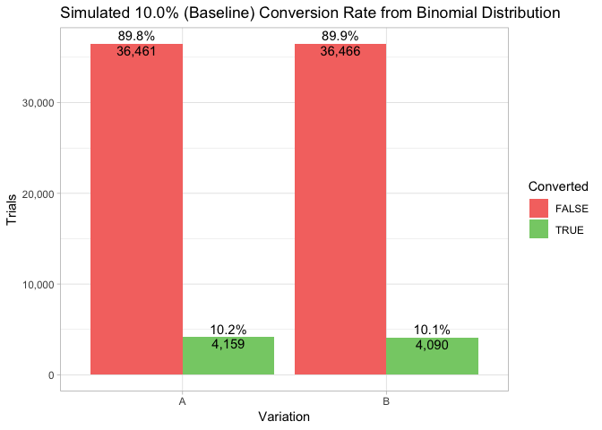
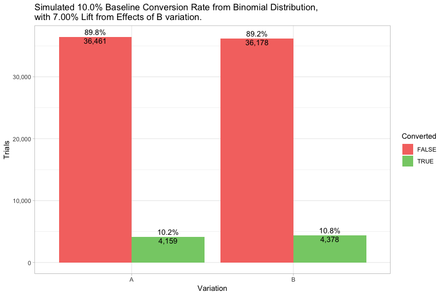
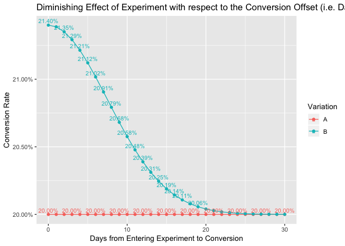
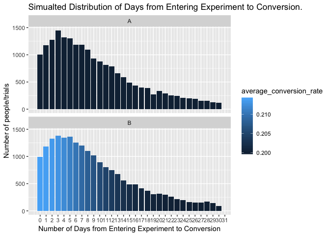
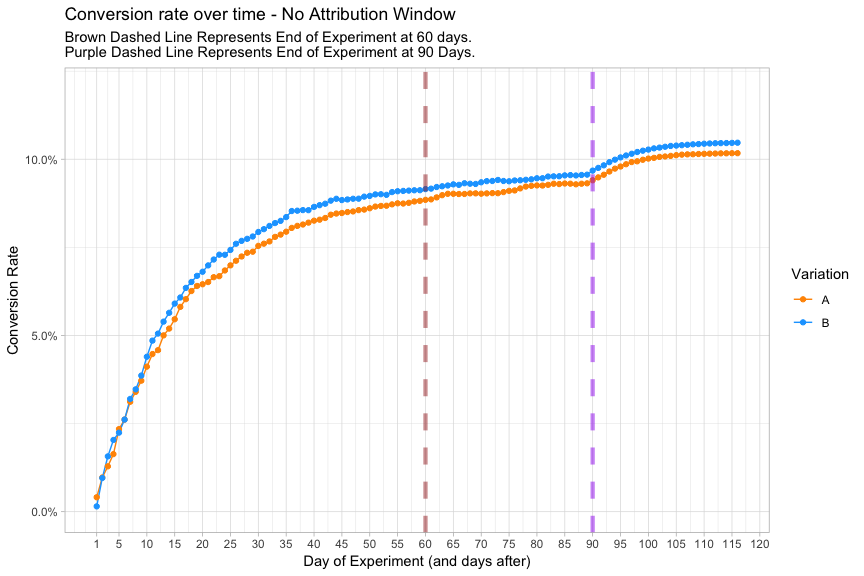
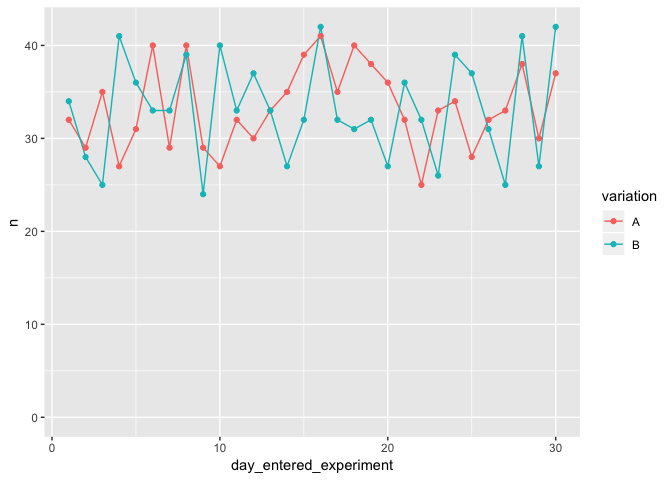
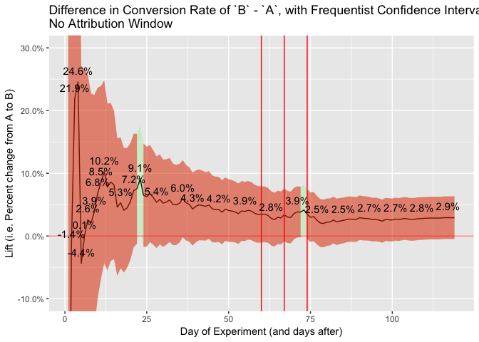

true

What affects does using (or not using) an attribution window have on A/B Testing?
=================================================================================

-   Create 20K trials in experiment, roughly 10K per randomized
    variation.
-   We'll randomly assign people into an `A` group or `B` group based on
    a random number generator 0/1

Now, we'll give everyone a baseline conversion rate of `20.0%`.

Let's simulate the conversion for each person and see the overall
conversion rates for each variation.

    ## [1] 0.8883228

P-value of above conversions: `0.8883228`

What we've done so far has simulated an experiment in which there was
**no** change in the `A` group vs the `B` group. It was an experiment
that might as well been an `A`/`A` test.

Now, let's simulate everyone in the `B` having a `7.00%` increase (due
from the affects of the new thing we are testing out.)

    ## [1] 0.0007538852

Due to random varaiation (i.e. random sampling from binomial
distribution), `B`'s conversion rate of `21.3%` is a `6.05%` increase
over the **true**\* baseline conversion rate of `20.0%` (that, because
we are simulating, we know to be the true conversion rate), and a
`6.43%` increase over `A`'s conversion rate of `19.9%`.

The P-value is now: `0.0007539`

But, here's the problem.
------------------------

These conversion rates assume that everyone that has converted, have
been given any amount of time to convert, and regardless of how long
after they converted, they had the same lift from the experiment.

This doesn't take into account:

-   the fact that people take different lengths of time to convert
    (relative to when they entered into the experiment) and
-   **the effects that that the A/B test has on a person, or group of
    people, diminishes over time.** It cannot be assumed that the effect
    of seeing a certain button, or certain design, or a certain
    experience, will have the same affect in that instant vs. 1 hour
    later vs. 1 day later vs. 30 days later. The effect of that "thing"
    on a person's decision or action will almost always, for almost
    everyone, diminish over time.

If we can assume this is a safe assumption, the question is: **What are
the effects of including conversion events from people who saw the
experiment "a long time ago"?**

Will these effects not matter since it is present in both variations?

We have to do 2 things.

First, we have to **simulate people converting at different lengths of
time, relative to when they saw the experiment**. (We'll assume everyone
in the experiment has not already converted; it won't affect the
outcome.)

Second, we have to **simulate the effect of the experiment diminishing
over time**.

Now, let's simulate a diminishing effect fromt the A/B test over time.

We'll try it with **linear** diminishing, although in most cases, my
assumption is it is more of an exponential dimishing effect, but we'll
stick with linear to be conservative.

Specifically, for everyone in the `B` group, I'll d

This is the key point. The longer you give people in the experiment to
convert, the less effect the **lift** from experiment has, and the
closer the conversion rates become.

No such effect exists in the `A` group because they maintain the
baseline conversion rate (there is nothing to diminish.)

But letting people convert e.g. 25-30 days after the experiment, you
will definitely capture the people who take longer to convert, but the
majority of people who convert are no longer affected, **so they are now
converting at a similar rate as the `A` group**\*, which removes the

Another way of saying this is it's likely that the people who converted
after 30 days were going to do so anyway, with or without the thing you
tested (or probably the majority of nauances and brain hacks in the
website).

So let's look at the results of the A/B test with the updated conversion
rates.

    ## [1] 0.06743339

Due to random varaiation (i.e. random sampling from binomial
distribution), `B`'s conversion rate of `20.7%` is a `3.20%` increase
over the **true** baseline conversion rate of `20.0%` (that, because we
are simulating, we know to be the true conversion rate), and a `3.58%`
increase over `A`'s conversion rate of `19.9%`.

The P-value is now: `0.0674334`

But this doesn't answer the question of the affects of attribution windows.
---------------------------------------------------------------------------

Let's simulate a 7-day attribution window (i.e. only counting the the
conversions that happen within 7 days.)

    ## [1] 0.001552428

The P-value is now: `0.0015524`

What if we simulate p-value and converison rate over time, with and
without the attribution window?

This isn't doing what i think it's doing.. becuase it's still not
counting the fact that a lot of people on the first day will not have
converted yet

    ## Warning: Removed 16 rows containing missing values (geom_path).

    ## Warning: Removed 16 rows containing missing values (geom_point).

    ## Warning: Removed 8 rows containing missing values (geom_path).

    ## Warning: Removed 8 rows containing missing values (geom_point).

    ## Warning: Removed 8 rows containing missing values (geom_text).

    ## [1] 423

    ## [1] 8117

    ##  [1]  1  2  3  4  5  6  7  8  9 10 11 12 13 14 15 16 17 18 19 20 21 22 23
    ## [24] 24 25 26 27 28 29 30 31 32 33 34 35 36 37 38 39 40 41 42 43 44 45 46
    ## [47] 47 48 49 50 51 52 53 54 55 56 57 58 59 60

Thoughts
========

-   Who is an A/B test inherently affecting? Are A/B tests affecting
    people that are more susceptible to certain psychological
    manipulations? Do the effects of A/B tests affect people that take
    longer to make a decision?
