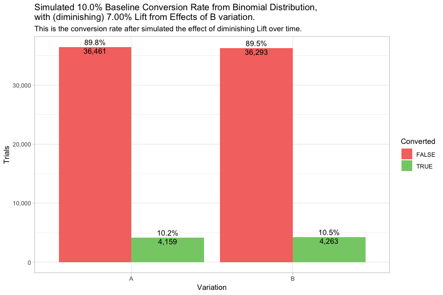
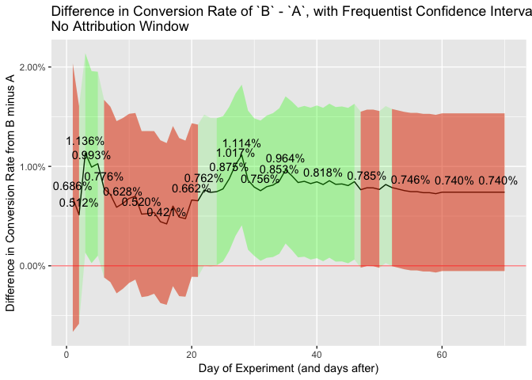

What are the effects of diminishing lift from an A/B test and the use of attribution windows?
=============================================================================================

A few definitions:

-   `control`: refers to either the `A` group, or the thing you show to
    the `A` group
-   `variant`: refers to either the `B` group, or the thing you show to
    the `B` group
-   `variation`: refers to either the `A` (`control`) group or `B`
    (`variant`).
-   `lift`: the percent increase from the `A` group to the `B` based on
    the thing you are testing in the `B` group (i.e. the `variant`)
-   `attribution window` the maximum number of days you allow
    conversions to be attributed to the corresponding variation based on
    when the person entered the experiment. So person `x` enters the
    experiment on day `y`. With a `7-day` attribution window, we would
    only count `x`'s conversion if the conversion event took place
    within `7` days of `y`. This would be the same for both variations.

There are two questions when running A/B tests that don't seem to be discussed much.
------------------------------------------------------------------------------------

The first question is: *Should I use an attribution window, and if so,
how long?*

In other words, how much time should I allow for a conversion to be
attributed to the corresponding variation of the experiment?

The typical process for A/B testing doesn't seem to consider/use an
attribution window: You run a test for, say, 30 days (depending on your
sample size calculator). The people who enter the experiment on the
first day it runs get 30 days to convert (i.e. their conversion event is
counted at any point during the experiment). The people who enter into
the experiment on the last day get &lt;= 1 day to convert. Perhaps some
teams give an extra, say, 7 days for conversion (so people who see the
experiment on the first day, get 37 days, people who see it on the last
day get 7.).

One assumption is, the fact that some people get more time and some
people get less time to convert doesn't matter, because of the
randomization of the control and the variant.

A related question is: *How does the diminishing lift, over time, from
the variant, affect the outcome of the experiment and what effect does
using an attribution window have?*

My assumption is that there is a diminishing effect of the variant on
the person's decision-making process or actions, over time, relative to
one the person first saw the variant. In other words, for *most* A/B
experiments, most people will see the variant (e.g. certain button,
page, or experience that is different from what people in the control
saw) and the impact (i.e. the *lift*; the impact on the person compared
to what they would have experienced had they been in the control group)
that the particular variant gives is highest in the first moments that
it is experienced, but that impact (exponentially?) decreases over time.
At the extreme, if a person "converts" (e.g. buys your product/service)
a year after seeing the variant, that variant had virtually nothing to
do with conversion. Depnding on the experiment/variant, we can probably
make similar statements for (perhaps) days, (mostly likely) weeks, and
(certainly) months after the variant is seen.\*\*\*

The concern is that the longer you give people to convert, the less
*lift* there is, and you're essentially including people who are, at
that point, converting at the same rate as the control group. This
introduces noise into your experiment. Can we use an attributionw window
to reduce the noise? Will the attribution window also reduce the signal?

\*\*\*Perhaps this means that A/B testing is inherently targeting people
that either A) more suspectible to pschogolical manipulation (e.g. mind
hacks, high pressure sales tactics, buying things based on whether it's
sunny or dark outside, etc.) and/or B) wanting to make an immediately
decision C) impulsive buyers. But, that's a direction I don't want to go
right now. The caveat to this is that, there are of course experiments
that you run where, for example, you've completely redesigned your
product and that new experience does have a long lasting impact on the
customers decision. In those cases, the lift is high enough that any
concerns we deal with here are probably going to disappear from the
large lift.

Simulate A/B Groups
-------------------

-   We'll create `40,000` trials in experiment, roughly `20,000` per
    randomized variation.
-   Then we'll randomly assign people into an `A` group or `B` group
    based on a random number generator (0/1).

Simulate Conversion Rates
-------------------------

Now, we'll give everyone a baseline conversion rate of `20.0%`.

Specifically, we'll assign each person a conversion rate (i.e.
probability) then take a random sample from the binomial distribution
using othat probabilty to determine if that person converted.

Let's simulate the conversion for each person and see the overall
conversion rates for each variation.

P-value of above conversions: `0.8883228`

What we've done so far has simulated an experiment in which there was
**no** change in the `A` group vs the `B` group. It was an experiment
that might as well been an `A`/`A` test.

Now, let's simulate everyone in the `B` having a `7.00%` increase (due
from the affects of the new thing we are testing out.)

Due to random varaiation (i.e. random sampling from binomial
distribution), `B`'s conversion rate of `21.3%` is a `6.05%` increase
over the **true**\* baseline conversion rate of `20.0%` (that, because
we are simulating, we know to be the true conversion rate), and a
`6.43%` increase over `A`'s conversion rate of `19.9%`.

The P-value is now: `0.0007539`

But, here's the problem.
------------------------

These conversion rates assume that everyone that has converted, have
been given any amount of time to convert, **and regardless of how long
after they converted (relative to when they entered the experiment),
they had the same lift from the experiment**.

This doesn't take into account:

-   the fact that people take different lengths of time to convert
    (relative to when they entered into the experiment) and
-   **the effects that that the A/B test has on a person, or group of
    people, diminishes over time.** It cannot be assumed that the effect
    of seeing a certain button, or certain design, or a certain
    experience, will have the same affect in that instant vs. 1 hour
    later vs. 1 day later vs. 30 days later. The effect of that "thing"
    on a person's decision or action will almost always, for almost
    everyone, diminish over time.

If we can assume this is a safe assumption, the question is: **What are
the effects of including conversion events from people who saw the
experiment "a long time ago"?**

We have to do 2 things.

First, we have to **simulate people converting at different lengths of
time, relative to when they saw the experiment**. (We'll assume everyone
in the experiment has not already converted; it won't affect the
outcome.)

Second, we have to **simulate the effect of the experiment diminishing
over time**.

Now, let's simulate a diminishing effect fromt the A/B test over time.

Now let's apply the "Percent of Lift Applied" to the Baseline Conversion
Rate and the Lift in the Variant.

*This is the key point*. The longer you give people in the experiment to
convert, the less effect the **lift** from experiment has, and the
closer the conversion rate becomes to the `A` group.

No such effect exists in the `A` group because they maintain the
baseline conversion rate (there is nothing to diminish.)

But letting people convert e.g. 20-30 days after the experiment, you
will definitely capture the people who take longer to convert, but the
*majority* of people who convert are no longer affected by the
experiment, **so they are now converting at a similar rate as the `A`
group**\*, which add noise into the experiment.

Another way of saying this is it's likely that the people who converted
after 30 days were going to do so anyway, with or without the thing you
tested (or probably the majority of nauances and brain hacks in the
website).

So let's look at the results of the A/B test with the updated conversion
rates.

Including the people in the experiment that converted many days after
they saw the experiment, seems to dilute the conversion rate. Again,
more and more people are converting at the same conversion rate as the
`A` group.

Now, `B`'s conversion rate of `20.7%` is a only `3.18%` increase over
the **true** baseline conversion rate of `20.0%`, and a `3.56%` increase
over `A`'s conversion rate of `19.9%`, which hasn't changed since the
last simulation.

The P-value is no longer statistically significant: `0.0692969`

But this doesn't answer the question of the affects of attribution windows.
---------------------------------------------------------------------------

Let's simulate a 7-day attribution window (i.e. only counting the the
conversions that happen within 7 days.)

The P-value is once again statistically significant: `0.0015524`.

In this case, it appears we have reduced enough of the noise from the
diluted effect and captured enough signal.

Now, `B`'s conversion rate is only `10.7%` because we are only counting
the people who converted within 7-days from when they entered they
experiment. But, it is a `9.02%` increase over `A`'s conversion rate of
`9.71%`.

What if we simulate p-value and converison rate over time, with and without the attribution window?
---------------------------------------------------------------------------------------------------

### No Attribution Window

### With Attribution Window

    ## Warning: Removed 16 rows containing missing values (geom_path).

    ## Warning: Removed 16 rows containing missing values (geom_point).

    ## Warning: Removed 8 rows containing missing values (geom_path).

    ## Warning: Removed 8 rows containing missing values (geom_point).

    ## Warning: Removed 8 rows containing missing values (geom_text).

    ## Warning: Removed 8 rows containing missing values (geom_path).

    ## Warning: Removed 8 rows containing missing values (geom_text).

    ## Warning: Removed 8 rows containing missing values (geom_path).

    ## Warning: Removed 8 rows containing missing values (geom_text).

Cautions
========

-   The effects seen from the diminishing lift and the attribution
    windows are based on many assumptions, including the distribution of
    days from entering into the experiment to conerting, and the
    rate/distribution of diminishing effect over time. There is also
    random variation in the simulation. It's possible that in other
    cases, other types of random variation will not pick up the same
    patterns.

Thoughts
========

-   Who is an A/B test inherently affecting? Are A/B tests affecting
    people that are more susceptible to certain psychological
    manipulations? Do the effects of A/B tests affect people that take
    longer to make a decision?
