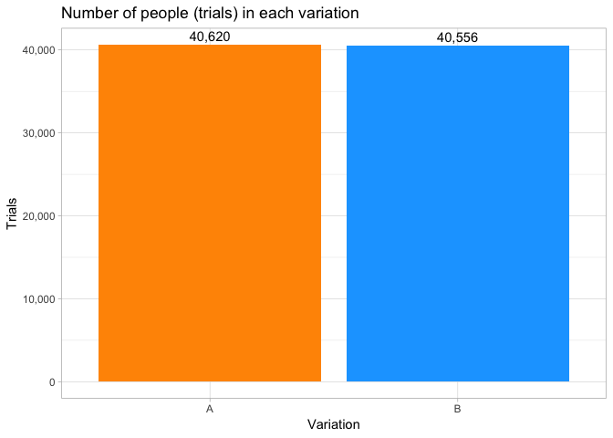
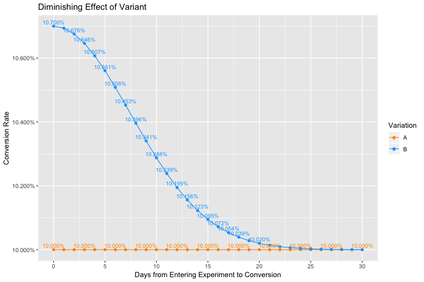
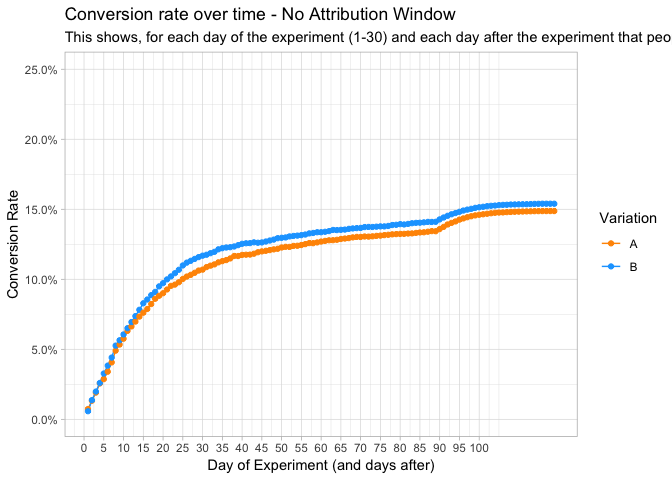
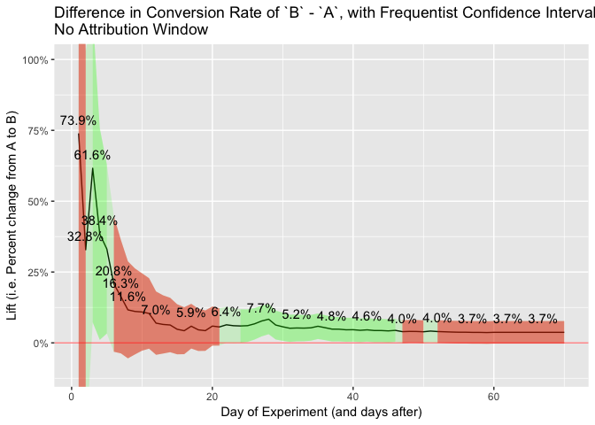
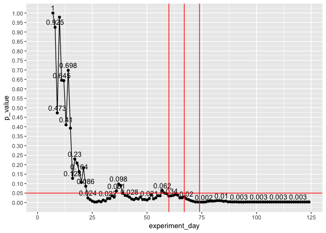
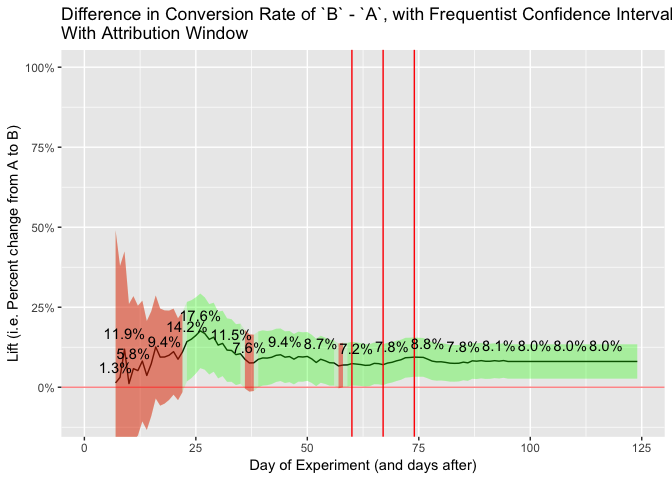

true

What are the effects of diminishing lift from an A/B test and the use of attribution windows?
=============================================================================================

A few definitions:

-   `control`: refers to either the `A` group, or the thing you show to
    the `A` group
-   `variant`: refers to either the `B` group, or the thing you show to
    the `B` group
-   `variation`: refers to either the `A` (`control`) group or `B`
    (`variant`).
-   `lift`: the percent increase from the `A` group to the `B` based on
    the thing you are testing in the `B` group (i.e. the `variant`)
-   `attribution window` the maximum number of days you allow
    conversions to be attributed to the corresponding variation based on
    when the person entered the experiment. So person `x` enters the
    experiment on day `y`. With a `7-day` attribution window, we would
    only count `x`'s conversion if the conversion event took place
    within `7` days of `y`. This would be the same for both variations.

There are two questions when running A/B tests that don't seem to be discussed much.
------------------------------------------------------------------------------------

The first question is: **How does the diminishing lift of the variant,
over time, affect the outcome of the experiment?**

My assumption is that there is a diminishing effect of the variant on
the person's decision-making process or actions, over time, relative to
when the person first saw the variant. In other words, for **most** A/B
experiments, most people will see the variant (e.g. certain button,
page, or experience that is different from what people in the control
saw) and the impact that the particular variant gives (i.e. the
**lift**; the increase to the person's probability of converting
compared to the probability had they been in the control group) is
highest in the first moments that it is experienced, but that lift
(exponentially?) decreases over time. At the extreme, for most
experiments, if a person "converts" (e.g. buys your product/service) a
year after seeing the variant, then that variant had virtually nothing
to do with conversion. Depending on the experiment/variant, we can
probably make similar statements for (perhaps) days, (mostly likely)
weeks, and (certainly) months after the variant is seen.(++)

The concern is that the longer you give people to convert, the less
**lift** there is, and you're essentially including people who are, at
that point, converting at the same rate as the control group. This
introduces noise into your experiment. Can we use an attributionw window
to reduce the noise? Will the attribution window also reduce the signal?

A related question is: **Should I use an attribution window, and if so,
how long?**

In other words, how much time should I allow for a conversion event to
be attributed to the corresponding variation of the experiment?

The typical process for A/B testing doesn't seem to consider/use an
attribution window: You run a test for, say, 30 days (depending on your
sample size calculation). The people who enter the experiment on the
first day it's started get 30 days to convert (i.e. their conversion
event is counted at any point during the experiment). The people who
enter into the experiment on the last day get &lt;= 1 day to convert.
Perhaps some teams give an extra, say, 7 days for conversion (so people
who see the experiment on the first day, get 37 days to convert, people
who see it on the last day get 7 days.).

One hypothesis is, the fact that some people get more time and some
people get less time to convert doesn't matter, because of the
randomization of the control and the variant (i.e. this characteristic
is present in both variations, in an equal way).

------------------------------------------------------------------------

++*Perhaps this means that A/B testing is inherently targeting people
that either A) more suspectible to pschogolical manipulation (e.g. mind
hacks, high pressure sales tactics, buying things based on whether it's
sunny or dark outside, etc.) and/or B) wanting to make an immediately
decision C) impulsive buyers. At the very least, it seems like the
target segment of A/B tests is the subpopulation of the target market
that takes less time to make decisions and/or has a more immediate need.
But, that's a direction I don't want to go right now. The caveat to this
is that, there are of course experiments that you run where, for
example, you've completely redesigned your product and that new
experience does have a long lasting impact on the customers decision. In
those cases, the lift is high enough that any concerns we deal with here
are probably going to disappear from the large lift. I assume that's not
the majority of A/B tests.*

------------------------------------------------------------------------

Simulate A/B Groups
-------------------

We'll create `40,000` trials in experiment, roughly `20,000` per
randomized variation.

Then we'll randomly assign people into group `A` or group `B`, based on
a random number generator.

Simulate Conversion Rates
-------------------------

### Simulate No Change

Now, we'll give everyone a baseline conversion rate of `20.0%`.

Specifically, we'll assign each person a conversion rate (i.e.
probability) then take a random sample from the binomial distribution
using that probabilty to determine if that person converted.

Let's simulate the conversion for each person and see the overall
conversion rates for each variation.

We can see that the conversion rate for each group is roughly the same.
The P-value of the above conversions is `0.8883228`, so there is no
statistical difference between the two conversion rates.

What we've done so far has simulated an experiment in which there was
**no** change in the `A` group vs the `B` group. It was an experiment
that was equivalent to an `A`/`A` test.

### Simualte `7.00%` Increase in Group B

Now, let's simulate everyone in the `B` group having a `7.00%` increase
(due from the effects of the new variant we are testing out.)

With the new conersion rate (and due to random varaiation i.e. random
sampling from binomial distribution), `B`'s conversion rate of `21.3%`
is a `6.05%` increase over the **true** baseline conversion rate of
`20.0%`, and a `6.43%` increase over `A`'s conversion rate of `19.9%`.

The P-value is now `0.0007539` and there is a statistically significant
difference between the variations.

But, here's the problem.
------------------------

These conversion rates assume that everyone that has converted, have
been given any amount of time to convert, **and regardless of how long
it took them to converted (relative to when they entered the
experiment), they had the same lift from the experiment** (specifically,
everyone in the `B` group had a `21.4%` probability of converting
(`20.0%` + (`20.0%` \* `7.00%`)), which was used to pull a random sample
from the binomial distribution to determine if they did convert).

This doesn't take into account:

-   the fact that people take different lengths of time to convert
    (relative to when they entered into the experiment) and
-   **the effects that that the A/B test has on a person, or group of
    people, diminishes over time.** It cannot be assumed that the effect
    of seeing a certain button, or certain design, or a certain
    experience, will have the same effect in that instant vs. 1 hour
    later vs. 1 day later vs. 30 days later. The effect of that "thing"
    on a person's decision or action will almost always, for almost
    everyone, diminish over time.

So, the next question is: **What are the effects of including conversion
events from people who saw the experiment "a long time ago"?**

We have to do 2 things.

First, we have to **simulate people converting at different lengths of
time, relative to when they saw the experiment**. (We'll assume everyone
in the experiment has not already converted; it won't affect the
outcome.)

Second, we have to **simulate the effect of the experiment diminishing
over time**.

### Simulate the Number of Days from Entering the Experiment to Converting

Everyone in the simulation is assigned a random number (based on a
modified Gamma distribution) that represents the number of days that
will take to convert **if they convert**. They are assigned the number
before the binomial distribution determines if they convert. The reason
for this is technical and intuitive. The technical reason is that the
probability given to the binomial distribution will be based on the
final probability assigned to the person which will be based on the
number of days they are assigned and the diminishing effect calculated
below. One intuitive reason (maybe a justification), is that this number
incorporates a lot of assumptions and characteristics about each person
that we can't directly simulate: the buying impluse of the person, the
degree of immediate need, the person's general thoughtfulness and
scrutenty of making a decision (e.g. purchase), susceptibility to
psychological "growth hacks", indecisiveness, and so on. These
characteristics affect how long it will take them to convert and,
either, as a result, or in addition to, how much they will be influenced
by the variant.

### Simulate the the Diminishing Effect of the Variant Over Time.

Now, let's simulate a diminishing effect that the variant has on a
person, based on the number of days it takes them

Here I'm simply taking the second half of a normal distirubution (i.e.
bell-curve) and modifying it to go from 100% to ~0% over 30 days, which
simulates the "relative effect" of the Lift of the experiment over time.

So, for example, if a person in the `B` group is assigned (from above) a
value that indicates they will potentially convert in the first day
(remember, there conversion depending on a random draw from the binomial
distribution), then that person will get the full effect of the lift of
the variant (i.e. they will get `100%` (top of the curve) of the `7.00%`
lift). On the other hand, if the person converts 30 days after seeing
the experiment, they experience very litle lift from the experiment (the
lift is not quite `0%`, but close.)

The the rate of the diminishing effect of an experiment is large
assumption of this simulation. This is my best guess at a reasonable
rate, and depending on the product/service/experiment, this graph will
certainly change.

Now let's apply the "Percent of Lift Applied" to the Baseline Conversion
Rate and the Lift in the Variant.

This graph shows the conversion rate (i.e. probability used in the
random draw from the binomial distribution) for each person according to
the number of days it took them to convert, relative to when they
entered the experiment.

Again, people that will potentially convert in the first days of joining
the experiment are assigned a conversion rate associated with majority
of the lift, and people that take a long time to convert, convert at the
same rate as the baseline conversion rate (which is the same rate as the
`A` group).

We can take our graph from above and show how the diminshed effect
influences the conversion rate of the people assigned to various days.

**This is the key point**. The longer you give people in the experiment
to convert, the less effect the **lift** from experiment has, and the
closer the conversion rate becomes to the `A` group.

No such effect exists in the `A` group because they maintain the
baseline conversion rate (there is nothing to diminish.)

By letting people convert e.g. 20-30 days after the experiment, you will
certainly capture the people who take longer to convert, but the
*majority* of people who convert are no longer effected by the
experiment, **so they are now converting at a similar rate as the `A`
group**, which adds noise into the experiment.

Another way of saying this is it's likely that the people who converted
after 30 days were going to do so anyway, with or without the thing you
tested (or probably the majority of nauances and brain hacks in the
website).

Update Conversion Rates, with Diminishing Lift
----------------------------------------------

So let's look at the results of the A/B test with the updated conversion
rates.

Including the people in the experiment that converted many days after
they saw the experiment, seems to dilute the conversion rate. Again,
more and more people are converting at the same conversion rate as the
`A` group.

Now, `B`'s conversion rate of `20.7%` is a only `3.20%` increase over
the **true** baseline conversion rate of `20.0%`, and a `3.58%` increase
over `A`'s conversion rate of `19.9%`, which hasn't changed since the
last simulation.

The P-value is no longer statistically significant: `0.0674334`

Attribution Windows
-------------------

So, we've seen the potential impact dimishing lift can have. (And to
stress this point, I'm **not** suggesting that the effect of dimishing
lift is always present (although in most cases it seems like a safe
assumption), or that it is always diminishing at the rate I assumed, or
that the effects of it show up consistently in the way we see above. I'm
simply showing what's possible, based on certain reasonable
assumptions.)

But so far, we haven't considered how we can use attribution windows, or
if we should.

Let's simulate a 7-day attribution window. In other wrods, we will only
count conversion events that happen within 7 days from the day that the
person entered the experiment.

The P-value is once again statistically significant: `0.0015524`.
(Although, to be fair, it might not have been if we didn't have a
sufficient sample size.)

In this case, it appears we have reduced enough of the noise from the
effects of the dimiished lift and captured enough signal.

Now, `B`'s conversion rate is only `10.7%` because we are only counting
the people who converted within 7-days from when they entered they
experiment. But, it is a `9.02%` increase over `A`'s conversion rate of
`9.71%`.

**The downside to using attribution-windows is that, because your
calculated conversion rate is lower (and depending on the size of the
window, it could be substantially lower), the sample size required to
reach statistical significance increases, along with the amount of time
required to run the test.**

P-Values and Confidence Intervals, Over Time
--------------------------------------------

What if we simulate p-value and converison rate over time, with and
without the attribution window?

### No Attribution Window

### With Attribution Window

    ## Warning: Removed 16 rows containing missing values (geom_path).

    ## Warning: Removed 16 rows containing missing values (geom_point).

    ## Warning: Removed 8 rows containing missing values (geom_path).

    ## Warning: Removed 8 rows containing missing values (geom_point).

    ## Warning: Removed 8 rows containing missing values (geom_text).

    ## Warning: Removed 8 rows containing missing values (geom_path).

    ## Warning: Removed 8 rows containing missing values (geom_text).

    ## Warning: Removed 8 rows containing missing values (geom_path).

    ## Warning: Removed 8 rows containing missing values (geom_text).

Cautions
========

-   The effects seen from the diminishing lift and the attribution
    windows are based on many assumptions, including the distribution of
    days from entering into the experiment to conerting, and the
    rate/distribution of diminishing effect over time. There is also
    random variation in the simulation. It's possible that in other
    cases, other types of random variation will not pick up the same
    patterns.
-   I assumed the baseline conversion rate remains the same and is not
    dependent on the number of days it took to convert. This was meant
    to be a simplifying assumption. In reality, the longer it takes
    people to convert, the lower probability they probabily have of
    converting. However, the same decrease in probabily will be present
    in both the control and variant groups. The major issue shown above
    is that the variant (`B`) group starts out at a higher probabilty,
    **relative** to the `A` group, and then over time **converges** to
    the `A` group's conversion rate (i.e. the baseline). If the baseline
    changes over time, you will still get the same **relative** start
    point and **convergence**. On the other hand, if we did account for
    the baseline conversion rate's potential decrease over time, we
    might see less conversion events in the areas that have similar
    conversion rates as the A group, and the result would be that we are
    over-estimating the impact (based on all the assumptions above) of
    the effects shown above.. Or... is this already accounted from the
    fact that there is, overall, a lot less people converting at that
    time. Yeah, now that i think about it. That's dumb, delete.
